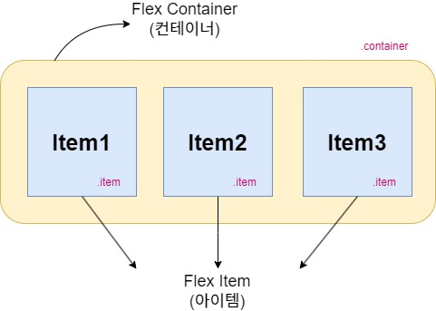
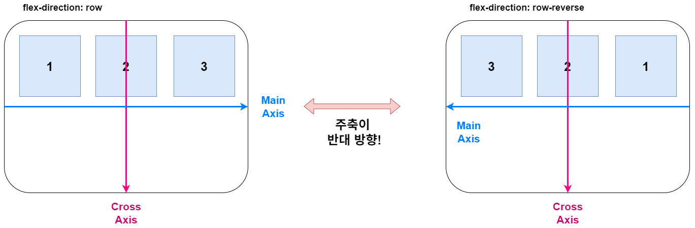
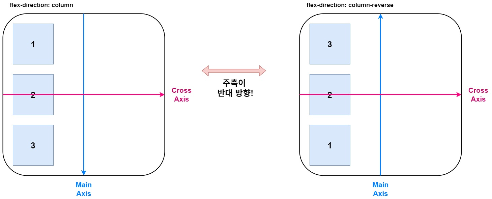
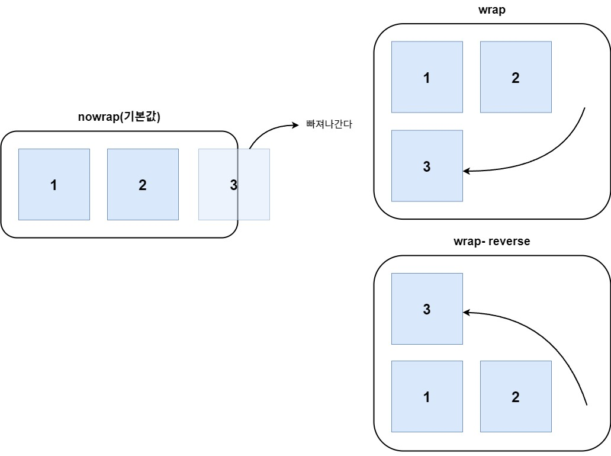
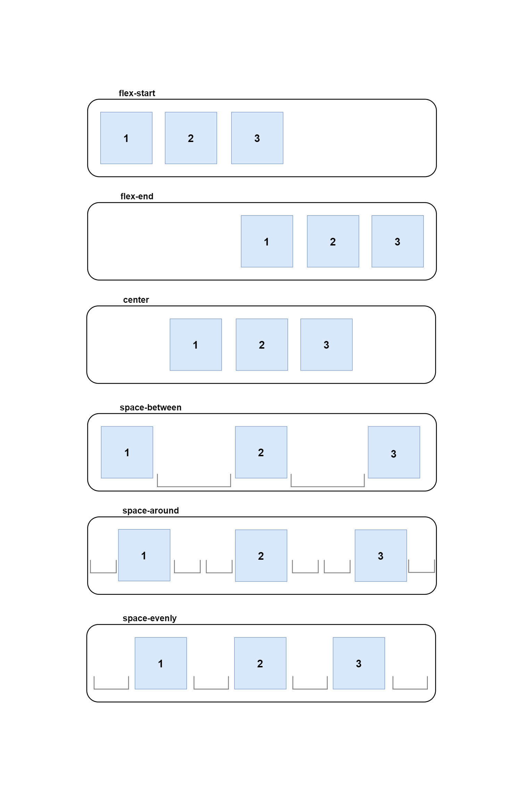
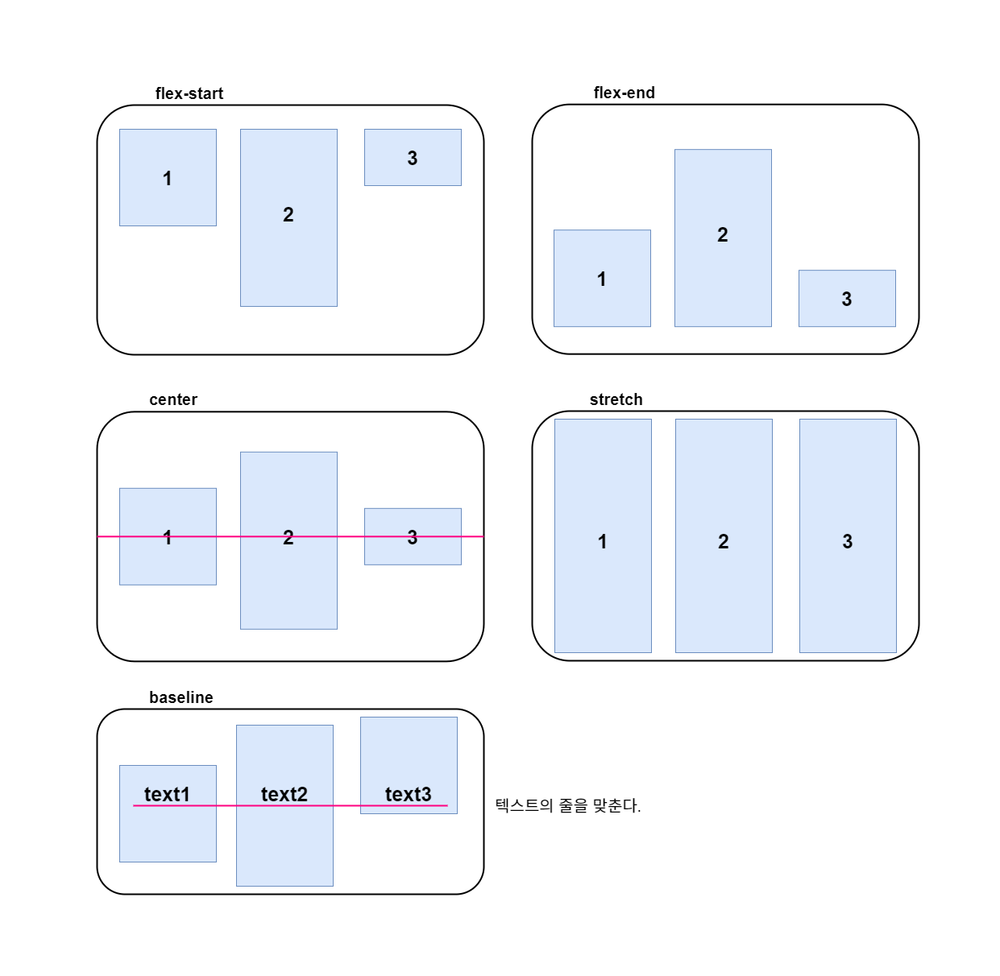
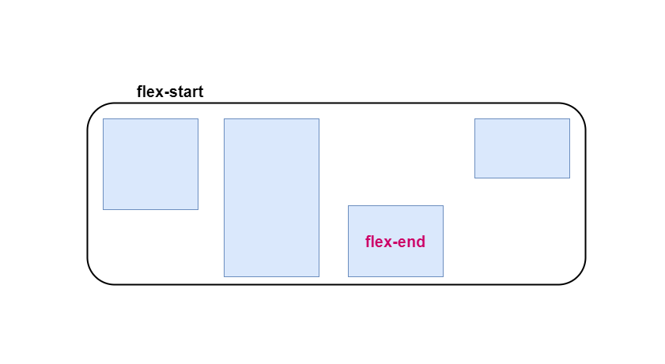

# 🍀 CSS Flexbox Container 정리

> CSS Flexbox에 대한 기본 개념을 정리한 문서입니다!

> [MDN Flexbox Guide](https://developer.mozilla.org/en-US/docs/Web/CSS/CSS_Flexible_Box_Layout)


---

## Flexbox의 정의

> Flexbox란?



> 컨테이너는 Flex의 영향을 받는 **전체 공간**이고, 설정된 속성에 따라 각각의 아이템의 배치 형태가 달라진다.

Flexbox는 `Flex Container`와 `Flex Items`로 구성된다.

- **Flex Container:** 부모 요소이다.
- **Flex Item:** Flex Container의 자식 요소이다.

따라서 Flexbox의 속성은 `Flex Container에 적용하는 속성`과 `Flex Items에 적용하는 속성`으로 나뉜다.


## 🧩 Flex 컨테이너에 적용하는 속성

flex 컨테이너를 사용하기 위해서는, 우선 컨테이너로 사용할 컴포넌트에 아래와 같은 css를 적용해야 한다.

```css
.container {
	display: flex;
	/* display: inline-flex; */
}
```

### 1. Flex Direction
Flexbox로 작업을 하기 위해서는 주축(Main Axis)과 교차축(Cross Axis)에 대한 개념을 알고 있어야 한다.

주축은 flex-direction 속성에 의해 정의되며, flex item은 **주축을 따라 이동**한다. 즉 아이템들이 배치되는 축의 방향을 결정하는 속성이다.
또한 교차축은 주축에 수직인 축이다.

```css
.container {
	flex-direction: row;
	/* flex-direction: column; */
	/* flex-direction: row-reverse; */
	/* flex-direction: column-reverse; */
}
```
- **설명**: 플렉스 아이템들이 배치되는 방향을 설정한다.
- **옵션**: `row`, `row-reverse`, `column`, `column-reverse`
- [MDN 문서](https://developer.mozilla.org/en-US/docs/Web/CSS/flex-direction)


- row(기본값): 아이템들이 행(가로) 방향으로 배치된다.
- row-reverse: 아이템들이 역순으로 가로 배치된다.



- column: 아이템들이 열(세로) 방향으로 배치된다.

- column-reverse: 아이템들이 역순으로 세로 배치 된다.

### 2. Flex-wrap

```css
.container {
	flex-wrap: nowrap;
	/* flex-wrap: wrap; */
	/* flex-wrap: wrap-reverse; */
}
```
- **설명**: 아이템이 컨테이너의 너비를 초과할 때 줄 바꿈을 어떻게 처리할지 결정하는 속성이다. flex-direction, flex-wrap의 순으로 한 칸 떼고 값을 지정하면 된다.
- **옵션**: `nowrap`, `wrap`, `wrap-reverse`
- [MDN 문서](https://developer.mozilla.org/en-US/docs/Web/CSS/flex-wrap)


- `nowrap`: 기본값으로 줄바꿈을 하지 않는다. 넘치면 아이템의 크기가 줄어들며 어떻게든 단일한 줄에 포함시키려고 한다.
- `wrap`: 플렉스 아이템이 여러 줄로 줄바꿈되어 표시된다.
- `wrap-reverse`: 플렉스 아이템이 아래에서 위로 여러 줄로 줄바꿈되어 표시된다.


### 3. Flex-flow

`flex-flow: <flex-direction> <flex-wrap>`

```css
.container {
	flex-flow: row wrap;
	/* 아래의 두 줄을 줄여 쓴 것 */
	/* flex-direction: row; */
	/* flex-wrap: wrap; */
}
```
- **설명**: `flex-direction`과 `flex-wrap`을 한꺼번에 지정할 수 있는 단축 속성이다.
- [MDN 문서](https://developer.mozilla.org/en-US/docs/Web/CSS/flex-flow)


### 4. Justify-content

```css
.container {
	justify-content: flex-start;
	/* justify-content: flex-end; */
	/* justify-content: center; */
	/* justify-content: space-between; */
	/* justify-content: space-around; */
	/* justify-content: space-evenly; */
}
```
- **설명**
    - **주 축(main axis)** 에서 아이템의 정렬 방식을 결정한다..
    - 여유 공간을 분산하는 데 도움이 된다.
- **옵션**
    - `flex-start`: 주축의 시작점부터 정렬한다.
    - `flex-end`: 아이템들을 끝으로 정렬한다.
    - `center`: 아이템들을 가운데로 정렬한다.
    - `space-between`: 모든 아이템들 **사이**에 균일한 간격을 만들어준다.
    - `space-around`: 모든 아이템들 양쪽에 균일한 간격을 만들어준다. 가장자리에는 1단위 공간이 있지만, item과 item 사이에는 2단위 공간이 존재한다.
    - `space-evenly`: item 사이의 간격과 가장자리의 간격까지 동일하도록 item을 정렬한다.
- [MDN 문서](https://developer.mozilla.org/en-US/docs/Web/CSS/justify-content)



### 5. Align-items

```css
.container {
	align-items: stretch;
	/* align-items: flex-start; */
	/* align-items: flex-end; */
	/* align-items: center; */
	/* align-items: baseline; */
}
```

- **설명**: **교차 축(cross axis)** 에서 아이템의 정렬을 결정한다.
- **옵션**
- `stretch`: 아이템이 교차축 방향으로 늘어난다.
- `flex-start`: 아이템들을 교차축의 시작점으로 정렬한다.
- `flex-end`: 아이템들을 교차축의 끝으로 정렬한다.
- `center`: 아이템들을 가운데로 정렬한다.
- `baseline`: 아이템들을 텍스트 베이스라인 기준으로 정렬합니다.
- [더 알아보기](https://developer.mozilla.org/en-US/docs/Web/CSS/align-items)



### 6. Align-content

- **설명**
    - **여러 줄**의 아이템을 교차 축에서 정렬한다.
    - flex-wrap이 wrap인 상태에서 적용해야 한다. (no-wrap이면 라인이 넘어가지 않아 계속 한 줄 상태이므로 여러 줄이 아님)
    - **라인 자체**를 정렬할 때 사용한다.
- **옵션**
    - `normal`: 기본값으로, Items이 값이 설정되지 않은 것처럼 기본 위치에 정렬된다.
    - `flex-start`: Items이 컨테이너의 시작 부분에 패킹된다.
    - `flex-end`: 컨테이너의 끝에 Items이 패킹된다.
    - `center`: 컨테이너의 중앙에 아이템들이 패킹된다.
    - `space-between`: 첫 번째 줄은 컨테이너의 시작 부분에, 마지막 줄은 컨테이너의 끝에 있고 각 줄 사이의 공간이 균등하게 줄이 분포된다.
    - `space-around`: Items이 주변에 동일한 공간으로 고르게 분포된다.
    - `stretch`: 나머지 공간을 차지하도록 선을 늘인다.
- [MDN 문서](https://developer.mozilla.org/en-US/docs/Web/CSS/align-content)

### 7. Align-self
- **설명**
    - 특정 아이템(개별)의 정렬을 재정의한다.
    - align-content 속성을 지워줘야 제대로 적용이 가능하다.
- **옵션**: `auto`, `flex-start`, `flex-end`, `center`, `baseline`, `stretch`
- [MDN 문서](https://developer.mozilla.org/en-US/docs/Web/CSS/align-self)




