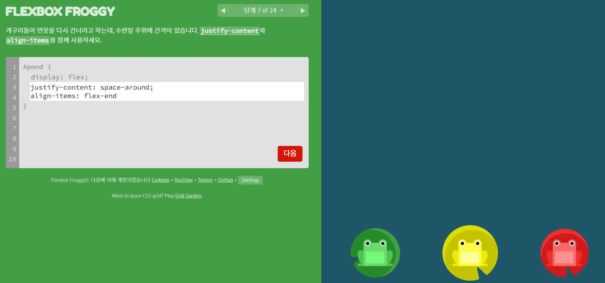

# 프론트엔드 강의 정리

## 📅 날짜: 8월 23일

### 📚 오늘의 강의 내용
- **강의 주제:**  CSS 기초와 스타일링 기법을 활용한 레이아웃 및 요소 조정
- **주요 내용:** 
  - box-shadow
  - 크롬 개발자 도구 사용
  - CSS Box model
  - Text 스타일링
  - 외부 스타일 태그 연결하는 법
  - object-fit / object-position 사용하기
  - transform
  - flex container - flex direction

### 📖 실습 및 데모
> 강의 중 실습한 내용이나 데모를 정리하기

### 🔄 복습 표
| 내용                  | 이해도  | 복습 필요 여부 | 복습 일자     | 복습 부분 |
|----------------------|--------|----------------|---------------|-----------|
| 4강               | ★★★★☆ | ✔️ | 24.09.10   | 전체 강의 |

### 📝 공유 자료 정리
- **강의 자료:**
  - #3 간단한 버튼을 만들면서 HTML CSS 배우기
- **코치님/동료 공유 자료:**
  - [John Ahn 강사님 - flex 게임](https://flexboxfroggy.com/)
   재밌다 ~

- **기타 참고 자료:**
  - [문서 이름 또는 링크](링크 입력)

### 📝 개인 메모
#### 💬 디버깅 및 변수 선언 키워드(var, let, const) 관련 참고 자료

오늘의 미션에 디버깅 관련된 내용이 있어 참고하기 좋은 링크를 공유드립니다!

https://ko.javascript.info/debugging-chrome

`setTimeout` 등으로 실행을 지연시키고 브라우저에서 중단포인트를 지정하거나 `debugger` 키워드를 사용하여  디버깅을 진행하면서 실행할 때마다 변수들의 값이 어떻게 바뀌는지 함수를 실행하면 콜스택이 어떻게 되는지 등을 보거나 디버깅 툴에 어떤 기능이 있는지 등에 대해 중점적으로 공부하시면 좋을 것 같아요!
- [Chrome으로 디버깅하기](https://ko.javascript.info/debugging-chrome)

`var`, `let`, `const`를 공부하면서 참고할만한 사이트도 공유드립니다!

- [오래된 var](https://ko.javascript.info/var): `var`은 모던 자바스크립트에서는 거의 사용할 일이 없다고 생각되는데요. 그래서 해당 페이지를 전체적으로 읽어보고 어렵다 싶으면 현재는 **요약 정도만 알고 있어도 큰 문제는 없다고 생각됩니다.**

알아두면 좋은 내용이지만 `호이스팅`이나 `변수 라이프 사이클` 등을 깊이 있게 이해해야 제대로 이해할 수 있어 읽어보고 어려우면 자바스크립트에 익숙해진 다음 공부하셔도 괜찮을 것 같아요.

